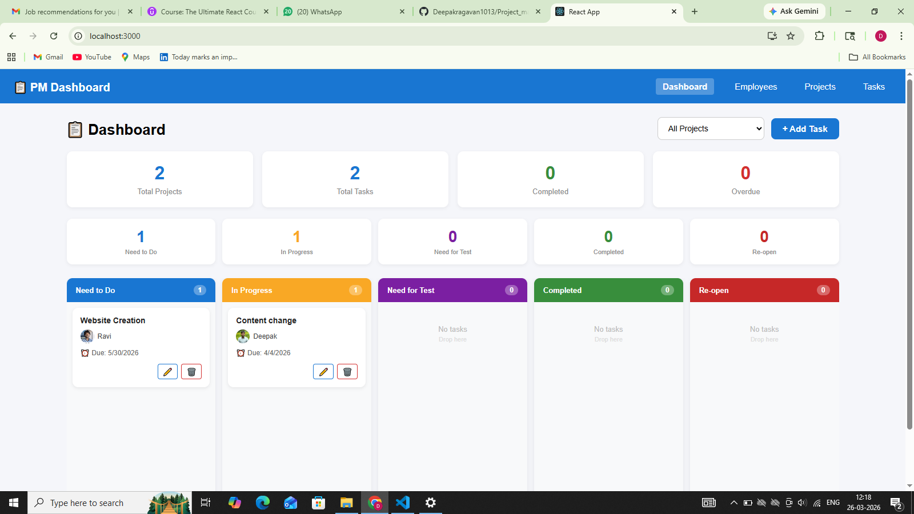
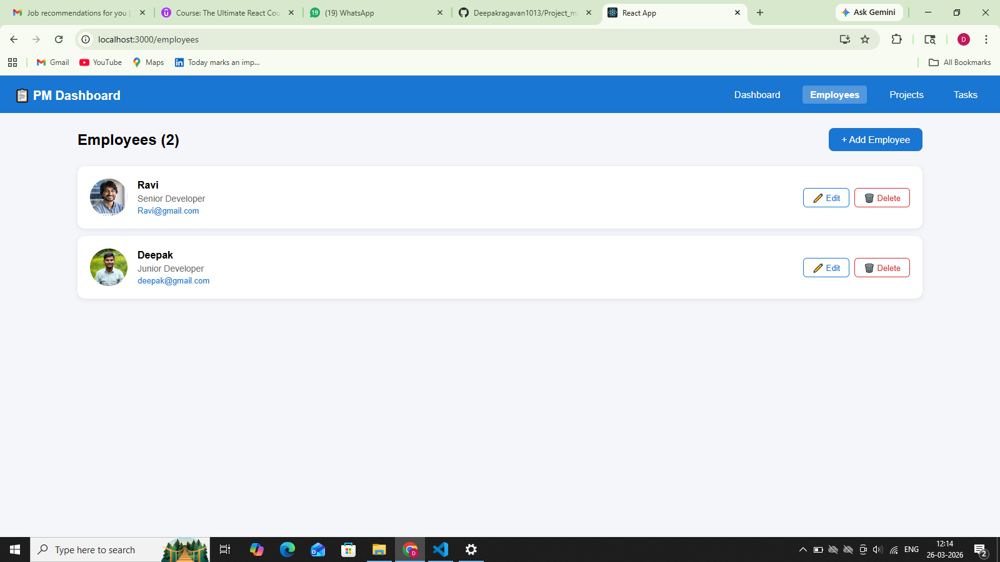
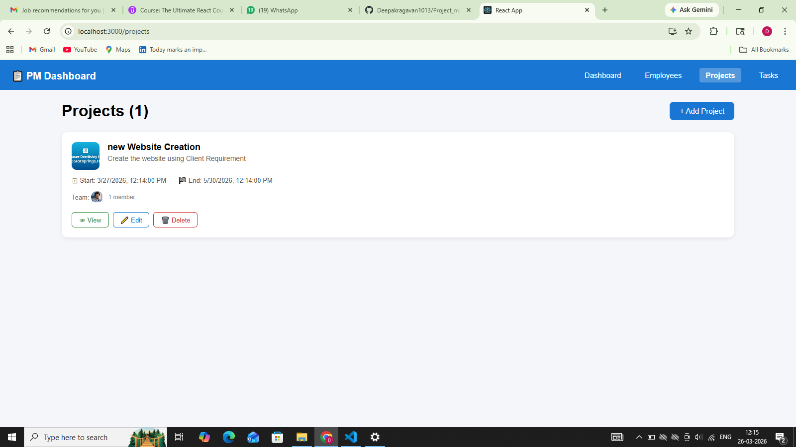
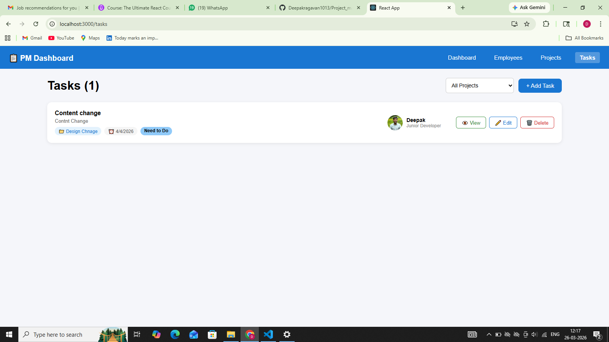

# Project Management Dashboard

A full-featured project management dashboard where you can manage employees, 
projects and tasks — complete with a Kanban board that supports drag and drop.

🚀 Live Demo: https://project-management-dashboard-ashen.vercel.app/

---

## Why I built it this way

I went with Redux Toolkit for state management because the data is shared 
across multiple pages — employees are used in projects, projects are used in 
tasks, and tasks show up on the dashboard. Passing all that through props 
would've been a nightmare, so a central store made much more sense.

For forms I used React Hook Form with Yup. I've used controlled inputs with 
useState before and the re-rendering on every keystroke gets messy fast. 
RHF handles that cleanly and Yup lets me define all the validation rules in 
one place.

The drag and drop is handled by @hello-pangea/dnd which is the maintained 
fork of react-beautiful-dnd. I picked it because the API is straightforward 
and it works well with Redux — when a card is dropped I just dispatch an 
action to update the task status.

---

## Getting it running

You'll need Node.js installed. Then:
```bash
git clone https://github.com/Deepakragavan1013/Project_management_dashboard
cd project-management-dashboard
npm install
npm start
```

Opens at https://project-management-dashboard-ashen.vercel.app/

---

## How to actually use it

The order matters here:

**Step 1 — Add employees first**

Go to the Employees page and add a few people. You need at least one 
employee before you can do anything else. Fill in their name, position, 
work email and upload a photo.

The email has to be unique — if you try to add two people with the same 
email it'll tell you.

**Step 2 — Create a project**

Go to Projects and create one. Give it a title, description, logo image 
and set the start and end dates. Then assign employees to it — you can 
select multiple people.

One thing to note: the end date has to be after the start date. Seems 
obvious but I added validation for it anyway.

**Step 3 — Add tasks**

Go to Tasks or the Dashboard and add a task. Select which project it 
belongs to first — the employee dropdown will then only show people who 
are actually assigned to that project. This was one of the trickier parts 
to get right.

Set an ETA and optionally upload some reference images.

**Step 4 — Use the board**

The Dashboard shows all tasks in a Kanban board with 5 columns:
- Need to Do
- In Progress  
- Need for Test
- Completed
- Re-open

Drag cards between columns to update their status. You can also filter 
by project using the dropdown at the top.

---

## Folder structure
```
src/
├── app/
│   └── store.js               
├── features/
│   ├── employees/
│   │   └── employeeSlice.js   
│   ├── projects/
│   │   └── projectSlice.js    
│   └── tasks/
│       └── taskSlice.js       
├── pages/
│   ├── Dashboard.jsx          
│   ├── Employees.jsx          
│   ├── Projects.jsx           
│   ├── ProjectDetail.jsx      
│   └── Tasks.jsx              
├── components/
│   ├── Navbar.jsx             
│   ├── Modal.jsx              
│   ├── TaskCard.jsx           
│   ├── TaskForm.jsx           
│   ├── EmployeeCard.jsx       
│   ├── EmployeeForm.jsx       
│   ├── ProjectCard.jsx        
│   └── ProjectForm.jsx        
├── routes/
│   └── AppRoutes.jsx          
└── utils/
    └── validationSchemas.js   
```

I tried to keep things organized by feature. Each Redux slice lives 
next to the feature it belongs to rather than everything dumped in 
one folder.

---

## Stack

- React 18
- Redux Toolkit
- React Router DOM v6
- React Hook Form + Yup
- @hello-pangea/dnd
- UUID for generating IDs
- redux-persist for keeping data after refresh

---

## Things I'd improve with more time

The data right now lives in localStorage via redux-persist. It works 
fine for a demo but in a real app you'd want a proper backend with a 
database so data is shared across devices and users.

I'd also add user authentication — right now anyone can see and edit 
everything. And probably some kind of activity log so you can see 
who changed what and when.

The UI could also use some work on mobile. It's usable but the Kanban 
board gets a bit cramped on small screens. A collapsible sidebar and 
better responsive breakpoints would help.

---

## Screenshots

| Dashboard | Employees |
|-----------|-----------|
|  |  |

| Projects | Tasks |
|----------|-------|
|  |  |

---

## Author

Deepakragavan J
cf012deepakragavan@gmail.com
https://github.com/Deepakragavan1013

